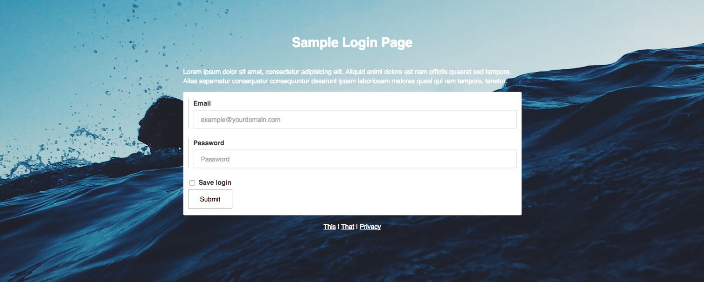
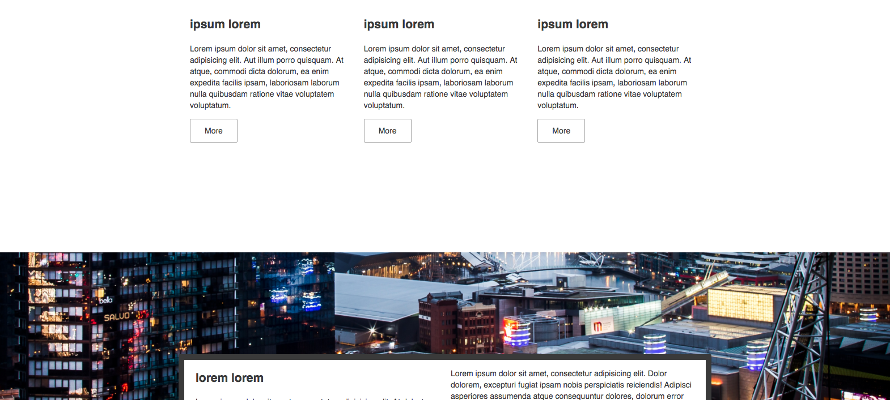

# CSS-MOUNT

Base css library for initial responsive frontend project setup.

SASS and dummy files are included.

LICENSE: MIT <https://github.com/TheW1zzard/css-mount/blob/master/LICENSE>

## CONTENTS

- variables
- main tags
- responsive grid
- basic image
- buttons
- navigation and footer
- tables
- lists
- forms

## DEFAULT VARS

    /* =============================
     * grid
     * =============================*/

    $grid_columns: 12;
    $grid_item_width: percentage(1 / $grid_columns);

    /* =============================
     * breakpoints
     * =============================*/

    $breakpoint_sm: "all and (max-width: 1024px)";
    $breakpoint_xs: "all and (max-width: 640px)";

Two basic breakpoints for tablet and mobile in general.

    /* =============================
     * space
     * =============================*/

    $default-space: 10px;
    $default-element-weight: 10px;

All elements are aligned by the default-space.

    /* =============================
     * font
     * =============================*/

    $font-family-base: sans-serif;
    $font-size-base: 14px;
    $line-height-base: 1.45;

    /* =============================
     * colors
     * =============================*/

    $color-base: #3a3a3a;
    $color-smooth-grey: #ddd;

Easy font and color customization.

Image material source: <https://unsplash.com/>
